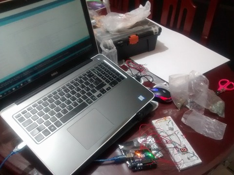

# Puerta con alarma

### Presenta: Francisco Javier Padilla Aguirre
### Estudiante de Ingeniería en Sistemas Computacionales del Instituto Tecnológico de León
### Materia: Sistemas Programables
***
## Índice
+ [Objetivo](#objetivo)
+ [Descripción](#descripción)
+ [Materiales](#materiales)
+ [Diagrama](#diagrama)
+ [Evidencias](#evidencias)
+ [Código](#código)
+ [Conclusiones](#conclusiones)
***
## Objetivo
>Desarrollar un programa que permita hacer el funcionamiento de una puerta con alarma.
***
## Descripción
>Se pretende aplicar en esta practica conceptos ya usados en clase, primordialmente hacer que cuando se simule abrir una puerta
>una alarma se emita, durante el periodo de el pitido de la alarma encienda un LED que sea de referencia a advertencia, durante ese
>periodo de transición un display hara una cuenta regresiva y cuando se aparezca el 1 y antes del 0 se debe presionar un pushbutton el 
>cual hará que la alarma se apague, de no hacer eso el buzzer y el LED pasara a un estado de peligro ( esto se refiere a que se emitiran
> en parpadeos durante un cierto ptiempo). Y así el programa se repetira cuantas veces se abra la puerta.
***
## Materiales
* 1 Protoboard
* 1 Arduino Uno
* Cables calibre 22
* 1 LED
* 1 Display
* 1 buzzer
* 1 reed switch
* 1 resistencia de 220 ohm
* Laptop o PC de escritorio
* Software IDE Arduino
* 1 pushbutton

***
## Diagrama

***
## Evidencias

***
## Código
~~~
/*Este programa se encargara de que cuando se abra una puerta suene una alarma y encienda un led de advertencia y en un conteo de 9 a 0 
 * al final debera se apretado un boton el cuál previene una alarma a la cual nos referiremos como arlma contra intruso, de no se apretado
 * el boton la alarma en tono de peligro se activara, este código y presente trabajo trata de simular una puerta como de un banco o hasta
 * de una misma casa en la cuál se puede llegar a implementar este tipo de seguridad.
 * El código es libre para que cada quien lo use y si gusta agregar más no habrá ningún inconveniente.
 */

#include "LowPower.h"                        //es la libreria que se encarga de que el arduino pueda entrar a un modo de ahorro de energia

int zumbador = 9;                           //se declara en que pin va ser de la bocina     
const int puerta=10;                       //se declara el pin que va recibir  el estado del reedswitch
int led = 11;                             //se declara el pin del led que se usará de advertencia
int Boton=12;                            // variable del pushbutton

void setup(){                           //inicia el metodo setup que se pondra las variables y cada puerto si será de salida o entrada 
  pinMode(puerta,INPUT_PULLUP);        //se indica que el pin del reed switch va a enviar un estado de abierto o cerrado      
  pinMode(led,OUTPUT);                //se indica que el pin del led de la alarma va recibir la señal del arduino
  pinMode(zumbador,OUTPUT);           //se indica que el pin de la bocina va recibir la señal del arduino
  pinMode(2,OUTPUT);                  //se indica que se va a usar el pin 2 del arduino para mandar señales
  pinMode(3,OUTPUT);                  //se indica que se va a usar el pin 3 del arduino para mandar señales
  pinMode(4,OUTPUT);                  //se indica que se va a usar el pin 4 del arduino para mandar señales
  pinMode(5,OUTPUT);                  //se indica que se va a usar el pin 5 del arduino para mandar señales
  pinMode(6,OUTPUT);                  //se indica que se va a usar el pin 6 del arduino para mandar señales
  pinMode(7,OUTPUT);                 //se indica que se va a usar el pin 7 del arduino para mandar señales
  pinMode(8,OUTPUT);                //se indica que se va a usar el pin 8 del arduino para mandar señales
  pinMode(Boton, OUTPUT);
}                                   //termino del metodo setup

void display(int a,int b,int c,int d,int e,int f,int g){  //se crea el metodo display que es el que se encarga de ordenar los pines con respecto a sus variables
  digitalWrite(2,a);                                      //se une el pin 2 del arduino con su correspondiente variable 
  digitalWrite(3,b);                                      //se une el pin 3 del arduino con su correspondiente variable
  digitalWrite(4,c);                                      //se une el pin 4 del arduino con su correspondiente variable
  digitalWrite(5,d);                                      //se une el pin 5 del arduino con su correspondiente variable
  digitalWrite(6,e);                                     //se une el pin 6 del arduino con su correspondiente variable
  digitalWrite(7,f);                                     //se une el pin 7 del arduino con su correspondiente variable
  digitalWrite(8,g);                                     //se une el pin 8 del arduino con su correspondiente variable
}                                                        //termino del metodo display

void loop(){                                            //inicio del metodo loop que es el que se encarga de la funcionalida                                             
  LowPower.powerDown(SLEEP_8S, ADC_OFF, BOD_OFF);       // este es el modo de ahorro de energia en el cual como lo dice su primer parametro dura 8 segundos en esta fase en el cual se apagan los comvertidores de analofico a digital
      int value = digitalRead(puerta);                  //Aqui se leera la entrada que tenga la variable puerta 
       display (1,1,1,1,1,1,0);                         // Se mantiene en un inicio el display en 0 sin hacer más nada
      if(value == LOW){                                 //este if indica que cuado la pueta este cerrada no va ha hacer nada pero cuando este abierta se va a activar la alarma
        accionAlarma();                                 //para activar la alarma se procedara a ir al metodo que se muestra.
      
      }
       digitalWrite(led,LOW);                           //se apaga el led de advertencia
      digitalWrite(zumbador,LOW);                       //se apaga el buzzer
}                                                       // fin del loop

void accionAlarma(){                                    //El inicio del metodo de la accion de la alarma
         digitalWrite(led,HIGH);                        //como ya se abrio la puerta entonces se  prende el led de la alarma
         digitalWrite(zumbador,HIGH);                   //se activa el pitido de la alarma con la frecuencia establecida anteriormente
         display (1,1,1,0,0,1,1);                       //se manda al display el numero 9
         delay(700);                                    // el número 9 solo durara 700 milisengundos
         display (1,1,1,1,1,1,1);                       //se manda al display el numero 8
         delay(700);                                    //el número 8 solo durara 700 milisengundos
         display (1,1,1,0,0,0,0);                       //se manda al display el numero 7
         delay(700);                                    //el número 7 solo durara 700 milisengundos
         display (1,0,1,1,1,1,1);                       //se manda al display el numero 6
         delay(700);                                    //el número 6 solo durara 700 milisengundos
          display(1,0,1,1,0,1,1);                       //se manda al display el numero 4
          delay(700);                                  //el número 5 solo durara 700 milisengundos
          display(0,1,1,0,0,1,1);                      //se manda al display el numero 4
         delay(700);                                   //el número 4 solo durara 700 milisengundos
         display (1,1,1,1,0,0,1);                      //se manda al display el numero 3 
          delay(700);                                 // el número 3 solo durara 700 milisengundos
          display (1,1,0,1,1,0,1);                    //se manda al display el numero 2 
          delay(700);                                 // el número 2 solo durara 700 milisengundos
          display (0,1,1,0,0,0,0);                    //se manda al display el numero 1   
          delay(700);                                 // el número 1 solo durara 700 milisengundos
          display (1,1,1,1,1,1,0);                    //se manda al display el numero 0
          delay(700);                                 //el número 0 solo durara 700 milisengundos

          if(digitalRead(Boton)==LOW){                //este if permitira accionar mediante la pulsación del pushbutton hacer que la alarma pare cuando el display llegue a 0
            alerta();                                 // en el caso de que no se pulse se mandara al metodo alerta
          }else                                       // en caso contrario
          apaga();                                    //se mandara al metodo de apaga
          
                                                              
                                                      
}                                                       //se termina el metodo accionAlarma

void alerta(){                                        //inicia el metodo alerta
  for(int a=0; a<50; a++){                            // se hace un for el cual hará que se procese una acción desde un conteo de 0 hasta 50
  digitalWrite(led,HIGH); //Prende el LED             // se enciende el led
  digitalWrite(zumbador,HIGH);                        // se enciende el buzzer
  delay(50);                                          // tiempo de espera de 50 milisegundo
  digitalWrite(led,LOW);                              //Apaga el LED   
  digitalWrite(zumbador,LOW);                         //apaga buzzer
  delay(50);                                          //Tiempo   
}
  delay(1000);                                        // una vez terminado el for se hace una espera de 1 segundo
}                                                     //fin del metodo alerta

void apaga (){                                //inicia metodo apaga
  digitalWrite(led,LOW);                      //se apaga el led de la alarma
  digitalWrite(zumbador,LOW);                 //se apaga buzzer
}                                             //fin del metodo apaga

~~~

***

## Conclusiones

>Referente a la práctica fue algo interesante y a al vez confortante dado que se implemento la mayoría de las practicas o elementos que
>se fueron realizando antes de que se llegará a esta práctica, es un trabajo con el cuál quedo satisfecho y esperando que pueda ser
> de utilidad a la comunidad que accese a este.

